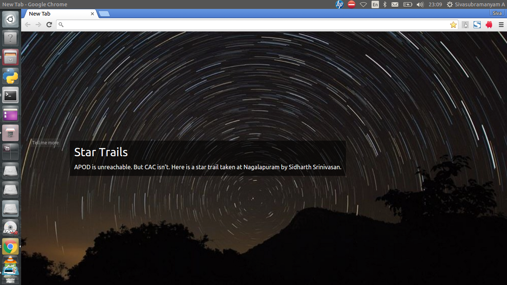

# chromapod
### Let's put some space in your new tabs!.

Fetches the current day's APOD image and sets it as the new tab window's background.

#### To install,

1. Download the extension as a [zip file](https://github.com/ChennaiAstronomyClub/chromapod/archive/master.zip).
2. Extract its contents in a directory of your choice.
3. Visit **[chrome://extensions](chrome://extensions/)**.
4. Verify that the **Developer mode** checkbox is checked.
5. Click on **Load unpacked extension**.
6. Navigate to the directory where the zip file's contents were extracted and click on **Open**.

All images copyright of their original owners.