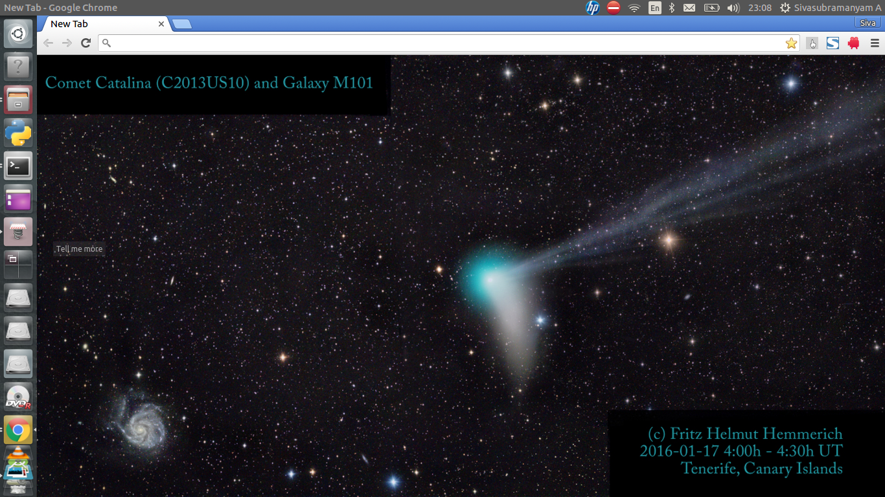
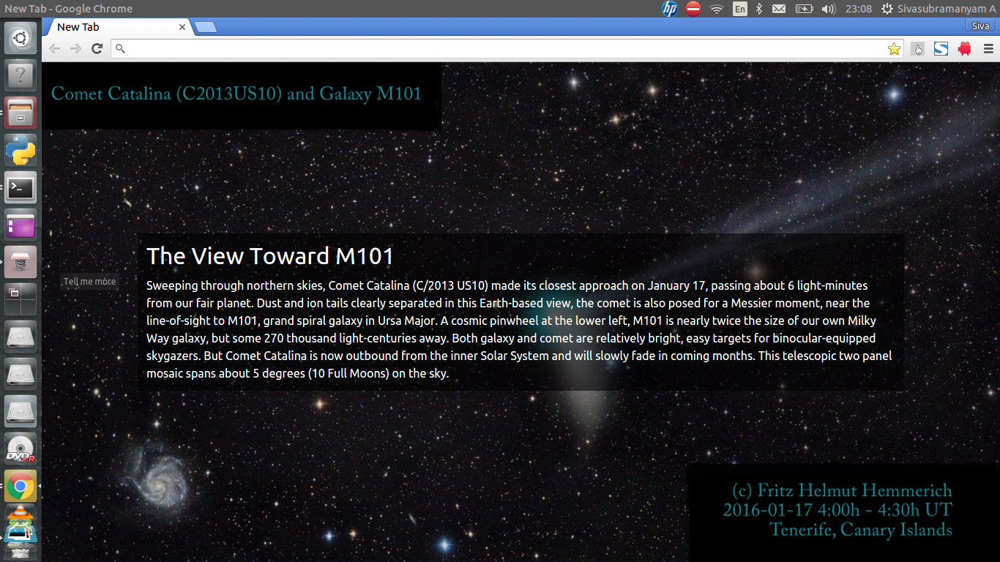

# chromapod
### Let's put some space in your new tabs!

Fetches the current day's APOD image and sets it as the new tab window's background.

#### To install,

1. Download the [extension](https://github.com/ChennaiAstronomyClub/chromapod/blob/master/chromapod.crx).
2. Visit **[chrome://extensions](chrome://extensions/)**.
3. Drag the downloaded file(from step 1) into the browser window.
4. Click on 'Add Extension'.

All images copyright of their original owners.